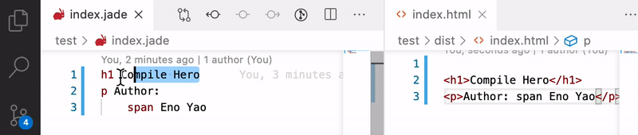
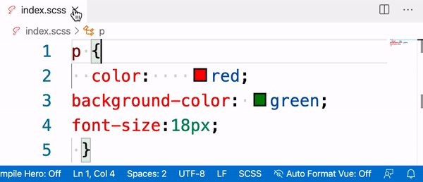
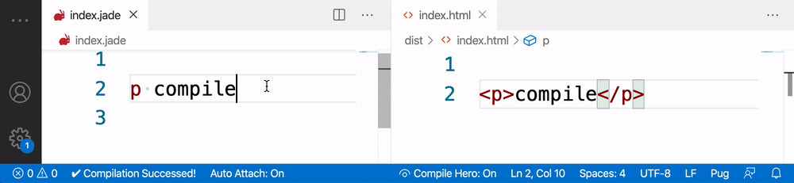
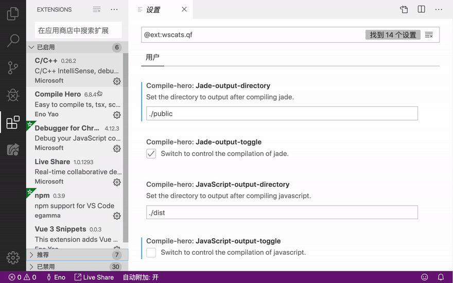
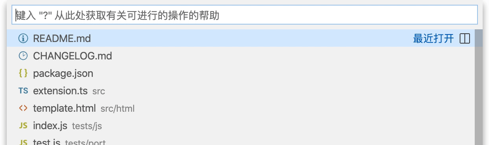

<!-- <a href="https://marketplace.visualstudio.com/items?itemName=Wscats.eno"></a>
<a href="https://marketplace.visualstudio.com/items?itemName=Wscats.eno"></a> -->
<a href="https://github.com/Wscats/compile-hero"></a>
<a href="https://github.com/Wscats"></a>


[English](./README.md) | [中文](./README.CN.md)

# 特性

Visual Studio Code 中自动编译以下文件：`less, sass, scss, stylus, typescript, jade, pug and jsx`。

> 1.使用之前打开编辑器右下角底部栏开关 `Compile Hero: On` ↓


> 2.按快捷键 `(ctrl+s)` 

或者在文件列表右键菜单选择 `Compile Files` 命令启动编译，将会在该文件的同级目录 `dist` 下生成编译后的文件，希望能你远离 `webpack` 和 `gulp` 等编译工具繁琐的操作。


你还可以选中部分代码使用 `Compile Selected` 菜单项或者快捷键 `(ctrl+shift+s)`，进行代码块的局部编译。



> 3.按快捷键 `(alt+shift+f)` 或者在文件列表右键菜单选择 `Format Document` 将会帮你自动格式化文件。



- 按保存 `Ctrl+S` 会自动编译编译 `less, sass, scss, stylus, typescript, jade, pug and jsx` 等文件。
- 支持 `less, scss, scss` 等文件代码高亮。
- 支持在默认浏览器打开 `html` 文件。
- 支持压缩 `javascript` 和 `css` 文件。
- 支持格式化 `javascript`, `json`, `css`, `sass`, 和 `html` 等文件。

| 编译前      | 编译后   |
| ----------- | -------- |
| .pug        | .html    |
| .jade       | .html    |
| .scss(sass) | .css     |
| .less       | .css     |
| .styl       | .css     |
| .ts/.tsx    | .js(JSX) |
| .js(ES6)    | .js(ES5) |

# 配置参数

点击插件的配置选项 `Extension Settings`：

> 点击编辑器底部栏右下角 `Compile Hero: On/Off`，可以切换不同语言的自动编译开关。



> 你可以修改编译后目录和文件的输出位置



具体参数如下：

| 是否开启按 `(ctrl+s)` 时自动编译文件（所有语言的自动编译总开关） | 默认值 |
| ---------------------------------------------------------------- | ------ |
| disable-compile-files-on-did-save-code                           | false  |

| 编译失败左下角弹窗提醒开关 | 默认值 |
| -------------------------- | ------ |
| notification-toggle        | true   |

| 配置文件编译后的目录的输出路径 | 默认值 | 是否开启按 `(ctrl+s)` 时自动编译文件 | 默认值 |
| ------------------------------ | ------ | ------------------------------------ | ------ |
| javascript-output-directory    | ./dist | javascript-output-toggle             | true   |
| sass-output-directory          | ./dist | sass-output-toggle                   | true   |
| scss-output-directory          | ./dist | scss-output-toggle                   | true   |
| less-output-directory          | ./dist | less-output-toggle                   | true   |
| jade-output-directory          | ./dist | jade-output-toggle                   | true   |
| typescript-output-directory    | ./dist | typescript-output-toggle             | true   |
| typescriptx-output-directory   | ./dist | typescriptx-output-toggle            | true   |
| pug-output-directory           | ./dist | pug-output-toggle                    | true   |
| stylus-output-directory        | ./dist | stylus-output-toggle                 | true   |
| generate-minified-html         | false  |
| generate-minified-css          | false  |
| generate-minified-javascript   | false  |

## 使用 `settings.json`

> 在项目根目录下可以新建该目录和文件 `.vscode/settings.json` 配置高级选项。

这里列举一个 `.vscode/settings.json` 文件的例子:

```js
{
  "compile-hero": {
    "disable-compile-files-on-did-save-code": false, // 全局开关，false 为开启自动编译， 默认 true 为开启不自动编译
    "notification-toggle": false, // 关闭编译失败时候右下角的弹窗提醒
    "javascript-output-directory": "./out", // javascript 输出的目录
    "javascript-output-toggle": false, // 局部开关，true 为开启 javascript 自动编译，false 为不开启 javascript 自动编译
    "sass-output-directory": "./out", // sass 输出的目录
    "sass-output-toggle": true, // 局部开关，true 为开启 sass 自动编译，false 为不开启 sass 自动编译
    "ignore": ["src/test.js", "*/test.scss", "**/spec/*", "**/src/**/*"], // 禁止文件自动格式化和编译
  }
}
// 更多配置项：详见下列表格
```

## 使用 `tsconfig.json`

> 在 `.ts` 文件的同级目录创建 `tsconfig.json` 文件，这个文件可以覆盖 `typescript` 的默认编译配置。

这里列举一个 `.vscode/tsconfig.json` 文件的例子:

```json
{
  "compilerOptions": {
    "alwaysStrict": true,
    "importHelpers": false
  }
}
```

# 在浏览器预览页面

在目录菜单对着 `xxx.html` 文件点击右键，会出现 `Open In Browser` 选项，可以在启动浏览器中预览 `xxx.html` 该页面。


# 关闭端口(仅 MAC)

使用 `Close Port` 命令可以关闭对应的端口。



# 感谢

| [<br /><sub>Eno Yao</sub>](https://github.com/Wscats) | [<br /><sub>Aaron Xie</sub>](https://github.com/aaron-xie) | [<br /><sub>DK Lan</sub>](https://github.com/dk-lan) | [<br /><sub>Yong</sub>](https://github.com/flowerField) | [<br /><sub>Li Ting</sub>](https://github.com/Liting1) | <br /><sub>Xin</sub> | [<br /><sub>Lemon</sub>](https://github.com/lemonyyye) | [<br /><sub>Jing</sub>](https://github.com/vickySC) | [<br /><sub>Lin</sub>](https://github.com/shirley3790) | [<br /><sub>Tian Fly</sub>](https://github.com/tiantengfly) |
| - | - | - | - | - | - | - | - | - | - |


要玩转 H5 这个插件你值得拥有！

如果你觉得有用，你可以给我们[留言和点赞](https://marketplace.visualstudio.com/items?itemName=Wscats.qf&ssr=false#review-details)，你的支持是我们前进的最大动力 😀

# 协议

遵循 [MIT](http://opensource.org/licenses/MIT) 协议。
