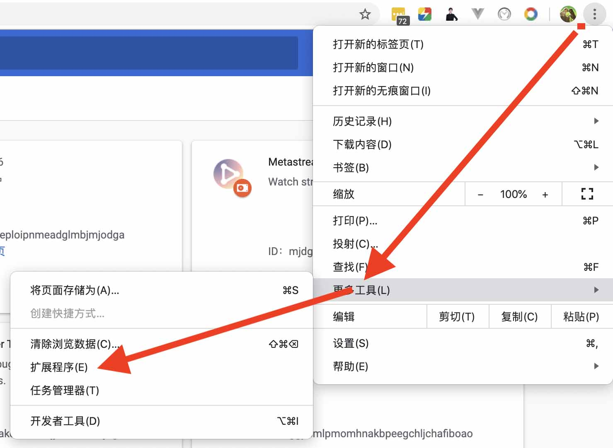

# 安装

- [点击此处下载Zip压缩后安装包](https://github.com/Wscats/hi/releases/download/1.0/hi.zip)

打开 Chrome 浏览器，点击右上角三个点，点击`更多工具`，选择`扩展程序`进入插件管理界面。

将下载好的`crx`插件文件拖到`Chrome`插件管理界面中，松开鼠标。

Chrome 会弹出安装插件的提示，点击`添加扩展程序`，完成上面这一步就能在 Chrome 插件管界面看到安装好的插件了。

# 运行

安装成功后